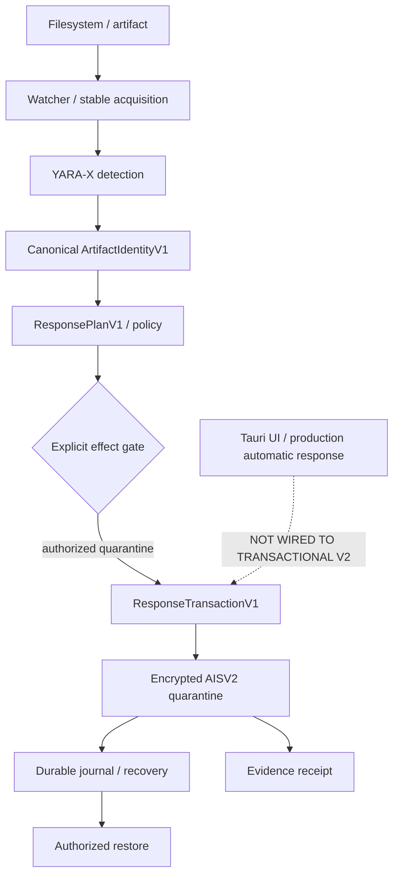

# AIOM Sentinel

> AI-native endpoint-security prototype for macOS, written in Rust.

AIOM Sentinel is a Rust/Tauri defensive endpoint-security prototype combining YARA-X detection,
typed policy decisions, encrypted transactional quarantine, crash-safe recovery, authorized
restore, and adversarial filesystem verification. It is locally verified on macOS/Unix; it is not
claimed as a production EPP or antivirus.

## Portfolio Release Candidate

| Measured local verification | Result |
| --- | --- |
| Rust service tests | 68/68 PASS |
| Workspace tests | 132 PASS |
| Strict `sentinel-product-service` Clippy (`-D warnings`) | PASS / 0 diagnostics |
| Protected-object security matrix | 24/24 PASS |
| Object-swap isolation | 4/4 PASS |
| Live response demos | 9/9 PASS |
| Quarantine failpoints | 10/10 PASS |
| Restore failpoints | 3/3 PASS |
| Slice 3C focused tests | 10/10 PASS |
| Portfolio demo verifier | PASS |

## What Sentinel does

Sentinel scans selected artifacts with the Rust-native YARA-X engine and carries a positive
detection through a bounded service-level response pipeline. The executable demo uses a harmless
fixture and a test-only key to prove the control flow; it does not enable production response.

The current local corpus also covers exact IOC lifecycle matching, signing/notarization evidence,
supply-chain primitives, and macOS behavior-correlation models. These are bounded static or
synthetic models, not claims of live process, WebView, Xcode, or security-control telemetry.

## Architecture



The transactional path is verified at service level. The desktop UI is intentionally not wired to
that path, and automatic production effects remain disabled. More detail is in
[docs/ARCHITECTURE.md](docs/ARCHITECTURE.md).

## 60-second demo

Prerequisites: Rust 1.93+ and Cargo. From the repository root:

```bash
./scripts/verify-demo.sh
```

It proves a harmless fixture moves through detection marker → canonical identity → audit/no-effect
control → explicit quarantine policy → transaction → encrypted quarantine → receipt. Success ends
with:

```text
AIOM_SENTINEL_SLICE_3C_DEMO: PASS
```

## Security invariants and adversarial testing

- Identity is derived from artifact bytes actually read by the canonical adapter; stale detection
  metadata is not authoritative.
- Audit and disabled policy plans cannot create quarantine transactions.
- Only an enabled, identity-bound `Quarantine` plan can create a transaction.
- Artifact mutation between planning and effect is rejected fail-closed.
- Quarantine and restore use encrypted AISV2 objects, durable state transitions, no-replace
  publication, and explicit restore authority.
- The service regression corpus covers 24 protected-object cases, four object-swap races, ten
  quarantine failpoints, and three restore failpoints.

## Verification

```bash
cargo fmt --all -- --check
CARGO_NET_OFFLINE=true cargo check --workspace --all-features --locked
CARGO_NET_OFFLINE=true cargo test --workspace --all-features --locked
CARGO_NET_OFFLINE=true cargo clippy -p sentinel-product-service --all-targets --locked -- -D warnings
./scripts/verify-demo.sh
```

The desktop frontend has its own locally available checks:

```bash
cd apps/sentinel-desktop
pnpm typecheck
pnpm build
```

## Repository structure

- `crates/` — Rust domain, scanner, rule engine, product service, and CLI crates.
- `apps/sentinel-desktop/` — Tauri desktop shell and TypeScript UI.
- `scripts/verify-demo.sh` — deterministic harmless Slice 3C demo verifier.
- `docs/` — architecture, release boundaries, research provenance, and portfolio material.
- `tests/` — integration tests and harmless fixtures.

## Build and run

Build the Rust workspace:

```bash
cargo build --workspace --all-features --locked
```

Run a bounded YARA-X fixture scan:

```bash
cargo run -p sentinel-cli -- scan tests/fixtures/harmless-yara-positive.txt \
  --yara-rules tests/fixtures/harmless.yar --yara-namespace fixture --json
```

## Known limitations

Sentinel is a prototype. macOS/Unix local verification does not establish Windows response parity,
production key authority, transactional Tauri response wiring, automatic production remediation,
real-malware efficacy, installer/service readiness, or privileged-path validation. Read
[docs/release/KNOWN_LIMITATIONS.md](docs/release/KNOWN_LIMITATIONS.md) before relying on a result.

## AI-native engineering workflow

The project was developed with an AI-native multi-agent engineering workflow: bounded coding
slices, separate review/adversarial passes, and executable acceptance gates before closure. Those
passes exposed TOCTOU defects, resulting in same-handle protected-object consumption,
restore-temp `(dev, ino)` identity enforcement, and replayable verifier/failpoint evidence. Human
operators retained architecture, scope, and release authority.

## Roadmap

This portfolio candidate stops at verified local defensive pipeline behavior. Future work is
documented rather than implied: production key lifecycle, Tauri transactional response wiring,
live telemetry collectors, external corpus qualification, and platform-specific validation.

## License

[MIT](LICENSE)
