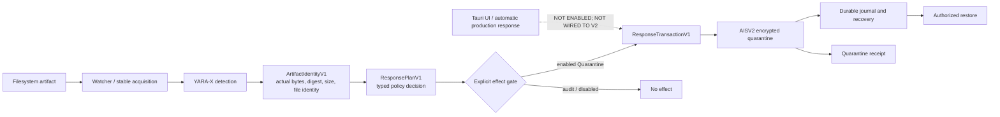

# AIOM Sentinel architecture

AIOM Sentinel is a bounded local defensive prototype. Its verified service-level response path is
separate from the current Tauri production UI boundary.

## Detection and identity

The scanner uses typed, bounded local engine results. A positive `ScanResultV1` is adapted to an
`ArtifactIdentityV1` by reopening and reading the artifact bytes. The adapter records canonical
path, SHA-256 digest, size, generation, and a Unix platform file identifier where available. It
does not trust caller-provided digest or size metadata.

## Policy and effects

`ResponsePlanV1` binds an artifact identity, action, policy reason, and `effect_enabled` flag.
Only an enabled `Quarantine` plan whose bound identity exactly matches the transaction artifact can
create `ResponseTransactionV1`. Audit and disabled policies are observable no-effect outcomes.
Raw action construction is test-only.

## Transactional quarantine and restore

The quarantine executor revalidates identity before effect, encrypts content as AISV2 with
AES-256-GCM, persists transaction state, and publishes without overwrite. Recovery replays journal
state idempotently. Restore requires explicit authority and rejects unsafe destinations,
substitution, metadata tampering, and key mismatch.

The repository tests protected-object handling, object swaps, failpoints, and recovery. These
checks establish local service behavior; they do not grant production response authority.

## Desktop boundary

The Tauri UI currently exposes a separate legacy quarantine path. It is intentionally not wired to
the transactional V2 service executor because no production key authority or automatic response
authorization exists. No collector, kernel component, system extension, live telemetry service, or
automatic production remediation is claimed.
