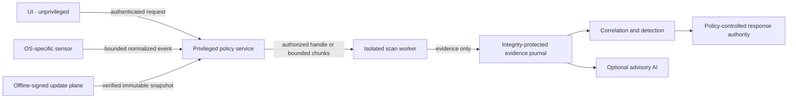

# Trust Boundaries and DFD

implementation_authority: NONE
current_runtime_status: DESIGN_ONLY

The UI has no sensor or kernel channel. Sensors cannot grant policy to themselves. Workers receive
only scoped capabilities and cannot mutate targets. Plugins are separate from workers and receive
versioned capability grants. Raw content, memory, identity, and case data cross a boundary only with
purpose, privacy class, size, retention, and authorization attached.

Threats include IPC spoofing, confused-deputy handle transfer, parser compromise, event loss,
rollback failure, update tampering, evidence deletion, plugin escape, and policy-service outage.
Required controls are mutual endpoint identity, ACLs, bounded queues, explicit backpressure, crash
isolation, public-key update verification, append-only evidence, and recovery drills.
